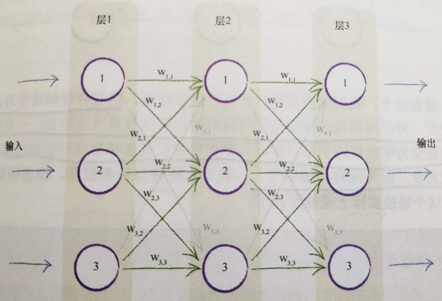
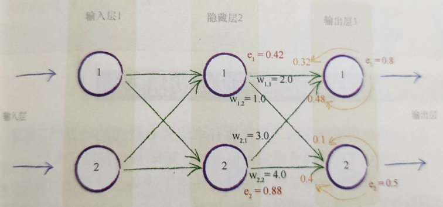
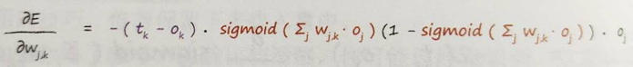
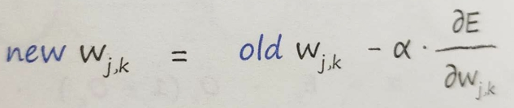
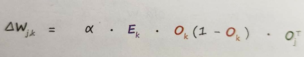

# Python_neuralnetwork_program

## 手写数字识别

### 以一个三乘三的网络为例，第一层也就是输入层只承担输入的作用，第二层称为隐藏层，具有求和以及激活的功能，第三层称为输出层同时具有求和、激活以及输出的功能

### 各个层之间的加权关系可以通过矩阵乘法计算

### 隐藏层输入与输入层之间的关系为:X=W·I,X为隐藏层输入、W为链接权重、I为输入层的输入

### 反向传播过程同样可以用矩阵乘法表示:errorhidden=WT·erroroutput

### 权重的更新过程

### 使用梯度下降的方法

======================2019年4月21日=====================
